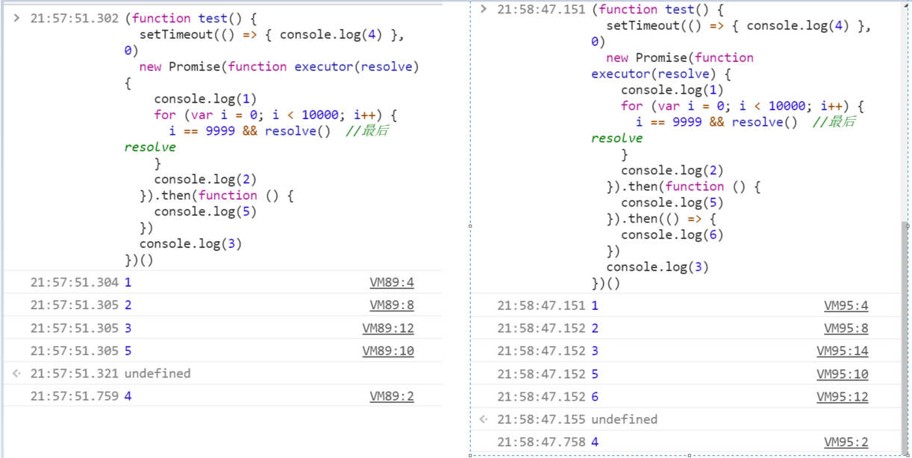

### node事件循环

```javascript
setTimeout(() => {
  console.log(1)
  setTimeout(() => {
    console.log(4)
  });
})

Promise.resolve().then(() => {
  console.log(3)
})

console.log(2)
//2,3,1,4
```

```javascript
setTimeout(() => {
  console.log(5)
})

process.nextTick(() => {
  console.log(6)
})

setTimeout(() => {
  console.log(1)
  setTimeout(() => {
    console.log(4)
  });
})

Promise.resolve().then(() => {
  console.log(3)
})

console.log(2)
//2 6 3 5 1 4
```

* 火焰图 浏览器performance  点击ctrl+e  stop 点击上面mermory


> 什么是事件循环 事件循环允许Node.js执行非阻塞异步io操作 尽管js是单线程 把异步操作从主线程拿掉
>
> Event Loop是一个程序结构，用于等待和发送消息和事件。
>
> 简单说，就是在程序中设置两个线程：一个负责程序本身的运行，称为"主线程"；另一个负责主线程与其他进程（主要是各种I / O操作）的通信，被称为"Event Loop线程"（可以译为"消息线程"）


> timers阶段 执行setTimeout() setInterval()
>
> pending callbacks 执行I/O 执行不了的循环到这个阶段运行
>
> idle prepare 不执行js
>
> poll 接收新的I/O事件 server.on('request') req.on('data') readFile 除了close callback ,被定时的timers, setImmediate()不在poll阶段执行，其他几乎都在这个阶段 如果在等待 且其他所有阶段没有东西 node会停在这个阶段 不会一直循环
>
> check setImmediate() 在这个阶段
>
> close callback socket.on('close')

* 其他所有阶段空 且poll阶段没有要等的东西了 即全空 就结束了

```javascript
setTimeout(() => {

}, timeout); //不是精确多少秒后执行 而是至少等xx秒之后执行
```


```javascript
const fs = require('fs');
const timeoutScheduled = Date.now();

setTimeout((f) => {
  const delay = Date.now() - timeoutScheduled;

  console.log(`${delay}ms have passed since I was scheduled`);
}, 100);

fs.readFile('a.txt',(g) => {
  const startCallback = Date.now();

  while (Date.now() - startCallback < 10) {
  }
})

//require date.now  settimeout readfile

//setTimeout T时间执行 进入timers 进入poll 
//100ms内 readfile读完 执行g  g结束 执行f
//等100ms 如果readfile 没读完 执行f 读完了 执行g  
```

* libuv c语言实现异步的库

 ```javascript
setTimeout(() => {
  console.log(1)
})
setImmediate(() => {
  console.log(2)
})
console.log(3)
//可能321 或者312 如果电脑快 执行完console.log(3) 进入timer 还没到1ms 就到了下面 那就是321
//电脑慢 进入timer已经1ms了  就是312
 ```

```javascript
var fs = require('fs')
fs.readFile('foo', (err,data) => {
  setTimeout(() => {
    console.log(1)
  })
  setImmediate(() => {
    console.log(2)
  })
})

// (err,data)回调 函数将在poll阶段执行 在check阶段安排打2 在timer阶段安排打1
// 所以先打2 再打1
```

> process.nextTick 不在事件循环队列
>
> nextTickQueue 将在当前阶段（phrase）完成执行 不管当前阶段在什么时候
>
> 所有阶段结束都会执行nextTickQueue 包括进入timer前的阶段

```javascript
var fs = require('fs')
setTimeout(() => {
  console.log(1)
})
setImmediate(() => {
  console.log(2)
})

process.nextTick(() => {
  console.log(3)
})
//312


setTimeout(() => {
  setImmediate((f) => {
    console.log(2)
  })
  process.nextTick((g) => {
    console.log(3)
  })
})

//32 进入timer  f安排在check  g安排在timer结束后  安排完timer结束 32
```

```javascript
setTimeout(() => {
  setImmediate((f) => {
    console.log(2)
  })
  process.nextTick(function g() {
    console.log(3)
    process.nextTick(g)
  })  //process.nextTick 已经结束  不会形成调用栈 
})

//32 进入timer  f安排在check  g安排在timer结束后  g不断的安排g  永远执行不完 一直打3


setTimeout(() => {
  setImmediate(function f() {
    console.log(2)
    setImmediate(f)
  })
  setTimeout(() => {
    console.log(1)
  });
})

//2122222 .......
//和nexttick 不同 settimeout 安排ST下一次timer SI 后 timer阶段结束 
//然后check 打2 安排f到下一次check check阶段结束
//进入timer 打1 
```

* 异步不会无穷递归 导致调用栈爆炸

```javascript
function get(url, cb) {
  cb()
}//同步调用

function foo() {
  get('a.txt', data => {
    foo()
  })
}
foo()
//爆栈


function get(url, cb) {
  process.nextTick(cb)
}

function foo() {
  get('a.txt', data => {
    foo()
  })
}
foo()
//卡死 不爆栈 安排的太多


var queue = [function foo() {
  console.log(1)
  nextTick(foo)
}] //nexttickqueue

function nextTick(f) {
  queue.push(f)  
}

function runNextTickQueue() {  //执行nexttick
  while (queue.length) {
    var task = queue.shift()
    task()
  }
}

//不停的取出 然后把自己放进去
```

```javascript
var tickQueue = [function foo() {
  console.log(1);
  nextTick(foo)
}]//nextTick队列本身

function nextTick(f) {
  tickQueue.push(f)
}

function runNextTickQueue() {//执行nextTick队列
  while (tickQueue.length) {
    var task = tickQueue.shift()
    task()
  }
}

var immediateQueue = [function foo() {
  console.log(1);
  setImmediate(foo)
}]//immediate队列本身

function setImmediate(f) {
  immediateQueue.push(f)
}

function runImmediateQueue() {//执行immediate队列
  var thisQueue = immediateQueue

  immediateQueue = []

  while (thisQueue.length) {
    var task = thisQueue.shift()
    task()
  }
}
```

```javascript
this.listen = function (port) {
  listen()

  process.nextTick(() => {
    this.emit('listening')
  })
}

server.listen() //这里事件还没有emit 所以下面能监听到listening事件

server.on('listening', () => { }) //如果server.listen是同步 回调立即调用 但那时还没server.on('listening')
```

```javascript
eventer.on('foo', () => {
  console.log(1)
})
eventer.emit('foo') //立刻调用
console.log(2)
//1 2
eventer.on('foo', () => {
  console.log(1)
})
process.nextTick(() => eventer.emit('foo'))
console.log(2)
//2 1
```

```javascript
let fs = require('fs')
fs.readFile('a.txt', () => {
  console.log(1)

  setTimeout(() => console.log(2))
  setImmediate(() => console.log(3))
  process.nextTick(() => console.log(4))
})

console.log(5)
//5 1  4 3 2   readfile在poll阶段
```

```javascript
let fs = require('fs')
fs.readFile('a.txt', () => {
  console.log(1)
  setTimeout(() => console.log(2))
  setImmediate(() => console.log(3))
  process.nextTick(() => console.log(4))
})
setTimeout(() => console.log(6))
console.log(5)

//561432  
//首先log5 timer阶段有个6  poll阶段有个1
//如果进入timer 很快 时间还没到6 就会离开 
//514362
```

```javascript
setImmediate(() => {
  console.log(1)
  setTimeout(() => console.log(2))
  setImmediate(() => console.log(3))
  process.nextTick(() => console.log(4))
})
setTimeout(() => console.log(6))


//check 1  timer 6
//先timer  6 1 4 2 3
//先check  1 4 6 2 3
```

```javascript
var count = 0
var start = Date.now()

process.nextTick(function f() {
  count++
  if (Date.now() - start < 1000) {
    process.nextTick(f)
  } else {
    console.log(count)
  }
})
```

#### promise

```javascript
setImmediate(() => {
  console.log(1)
})
Promise.resolve().then(() => {
  console.log(2)
})
//2 1


process.nextTick(() => {
  console.log(1)
})
Promise.resolve().then(() => {
  console.log(2)
})
//1 2

readFile('foo', () => {
  process.nextTick(() => {
    console.log(1)
  })
  Promise.resolve().then(() => {
    console.log(2)
  })
  setImmediate(() => {
    console.log(3)
  })
})
//1 2 3


setImmediate(() => {
  Promise.resolve().then(() => {
    console.log(2)
  })
  setImmediate(() => {
    console.log(3)
  })
  setTimeout(() => {
    console.log(4)
  })
})
//2 4 3


setTimeout(() => {
  process.nextTick(() => {
    console.log(1)
  })
  Promise.resolve().then(() => {
    console.log(2)
  })
  setImmediate(() => {
    console.log(3)
  })
  setTimeout(() => {
    console.log(4)
  })
})
//1234
```

```javascript
readFile('aaa', () => {
  setImmediate(() => {
    console.log(3)
  })
  Promise.resolve().then(function f() {
    Promise.resolve().then(f)
  })
})
// 3 打不出来 类似nextTick()
```

```javascript
var count = 0
var start = Date.now()

Promise.resolve().then(function f() {
  count++
  if(Date.now()-start<1000){
    Promise.resolve().then (f)
  }else{
    console.log(count)
  }
})
```

```javascript
var count = 0
var start = Date.now()

process.nextTick(function f() {
  count++
  if (Date.now() - start < 1000) {
    if (Math.random() < 0.5) {
      process.nextTick(f)
    } else {
      Promise.resolve().then(f)
    }
  } else {
    console.log(count)
  }
})

setImmediate(() => {
  console.log(5)
})
//5380076
//5
```

```javascript
readFile('fwoeif', () => {
  process.nextTick(() => {
    console.log(1)
    process.nextTick(() => [
      console.log(2)
    ])
  })
  process.nextTick(() => {
    console.log(3)
  }) 
})
// 132

readFile('fwoeif', () => {
  process.nextTick(() => {
    console.log(1)
    process.nextTick(() => [
      console.log(2)
    ])
  })
  process.nextTick(() => {
    console.log(3)
  })

  Promise.resolve().then(() => {
    console.log(4)
  })
})
// 1 3 2 4 nextTick添加nextTick依然在Promise后面

```

```javascript
readFile('fwoeif', () => {
  Promise.resolve().then(() => {
    console.log(4)

    process.nextTick(() => console.log(1))
    Promise.resolve().then(() => console.log(2))
  })
})
// 4 2 1 进入promise 就先执行promise 再nextTick 同理 进入nextTick  也先nextTick 后promise
```

```javascript
async function foo() {
  console.log(1)
  var a = await Promise.resolve(2)
  console.log(a)
}

foo()
console.log(3)
// 1 3 2
```

```javascript
async function foo() {
  console.log(1)
  var a = await new Promise((resolve, reject) => resolve(2)) //这个promise先创建出来 先挂上then（打印完1时）
  console.log(a)
  var b = await Promise.resolve(4)
  console.log(b)
}

foo()
console.log(3)

Promise.resolve().then(() => { //打印完3 挂then
  console.log(6)
})
// 1 3 2 6 4
```

```javascript
const Bluebird = require('bluebird')

async function foo() {
  console.log(1)
  var a = await new Bluebird((resolve, reject) => resolve(2)) //这个promise先创建出来 先挂上then（打印完1时）
  console.log(a)
  var b = await Promise.resolve(4)
  console.log(b)
}

foo()
console.log(3)

Promise.resolve().then(() => { //打印完3 挂then
  console.log(6)
})
// 1 3 6 2 4

var a = await new Promise((resolve,reject)=>{
    new Bluebird((resolve, reject) => resolve(2)).then(value=>{
      resolve(value)
    })
```

```javascript
(function test() {
  setTimeout(() => { console.log(4) }, 0)
  new Promise(function executor(resolve) {
    console.log(1)
    for (var i = 0; i < 10000; i++) {
      i == 9999 && resolve()  //最后resolve
    }
    console.log(2)
  }).then(function () {
    console.log(5)
  })
  console.log(3)
})()
// 1 2 3 5 4
// new Promise(这里面代码在构造promise时就完成了) 到')' promise才构建完成
```



```javascript
setTimeout(() => { console.log('a') })

var p = new Promise((resolve) => {
  console.log('b')
  resolve()
})

p.then(() => console.log('c'))
p.then(() => console.log('d'))
console.log('e')

async function async1() {
  console.log('a')
  await async2()
  console.log('b')
}

async function async2() {
  console.log('c')
}

console.log('d')

setTimeout(() => {
  console.log('e')
}, 0);

async1() //运行到await await之后的要运算出来

new Promise(function (resolve) {
  console.log('f')
  resolve()
}).then(function () {
  console.log('g')
})

console.log('h')

//b e d a c f h c d b g a e
```

### 浏览器事件循环

> 宏任务 微任务
>
> 微任务在调用栈执行完立即执行 微任务里安排微任务 在前面微任务结束后立即执行 异步递归 类似死循环
>
> 微任务执行后 会执行宏任务 之间有间隔 处理点击 处理交互 处理页面绘制
>
> 宏任务 ST Setinerval handlers requestAnimationFrame(窗口最小化 不执行)
>
> 微任务 promise.then  MutationObserver(监控DOM变化)

```javascript
mo = new MutationObserver(() => { console.log(1) }) //参数接收回调函数
mo.observe($0, { attributes: true, childList: true })
//$0 的属性 和子元素发生变化 会触发回调

function nextTick(f, ...args) {
  let div = document.createElement('div')
  let mo = new MutationObserver(f, ...args)
  mo.observe(div, { attributes: true })
  div.setAttribute('foo', 'bar')
}

nextTick(() => {
  console.log(1)
})
console.log(2)

setTimeout(() => {
  console.log(3)
})

// 2 1  1868(settimeout 返回结果 任务id) 3
```

```javascript
//浏览器模拟nextTick
function nextTick(f, ...args) {
  var div = document.createElement('div')
  var mo = new MutationObserver(() => f(...args))
  mo.observe(div, { attributes: true })
  div.setAttribute('foo', 'bar')
}


nextTick((a, b) => console.log(a + b), 5, 7)
console.log(2)
setTimeout(() => { console.log(3) })
```

```javascript
setTimeout(() => { console.log(1) })
var start = Date.now()
nextTick(function foo() {
  if (Date.now() - start < 1000) {
    nextTick(foo)
  }
})
//1秒后打1 微任务打印微任务 然后宏任务
setTimeout(() => { console.log(1) })
var start = Date.now()
Promise.resolve().then(function foo() {
  if (Date.now() - start < 1000) {
    Promise.resolve().then(foo)
  }
})
//也是微任务
nextTick(() => {
  console.log(1)
  nextTick(() => console.log(3)) //浏览器里 不区分 不会放在nextTick队列
})

nextTick(() => {
  console.log(2)
})

Promise.resolve().then(() => { console.log(4) })
Promise.resolve().then(() => { console.log(5) })
// 1 2 4 5 3
nextTick(() => {
  console.log(1)
  nextTick(() => console.log(3)) //浏览器里 不区分 不会放在nextTick队列
})

nextTick(() => {
  console.log(2)
})

Promise.resolve().then(() => { console.log(4) })
Promise.resolve().then(() => { console.log(5) })
setTimeout(() => { console.log(6) })
//  1  2 4 5 3 2192（google浏览器 微任务结束后才返回） 6
```

```javascript
nextTick(() => {
  console.log(1)
  nextTick(() => console.log(3)) //浏览器里 不区分 不会放在nextTick队列
})

nextTick(() => {
  console.log(2)
})

Promise.resolve().then(() => { console.log(4) })
Promise.resolve().then(() => { console.log(5) })
// 1 2 4 5 3
nextTick(() => {
  console.log(1)
  nextTick(() => console.log(3)) //浏览器里 不区分 不会放在nextTick队列
})

nextTick(() => {
  alert(111) //虽然已经执行完 textCntent变了 但是页面没有重绘
  console.log(2)
})
$0.textContent = 'aaa'
Promise.resolve().then(() => { console.log(4) })
Promise.resolve().then(() => { console.log(5) })
setTimeout(() => { alert(222); console.log(6) }) //这里重绘 空闲时间已经重绘了
//  1  2 4 5 3 2192（google浏览器 微任务结束后才返回） 6
```

```javascript
var count = 0
var start = Date.now()

nextTick(function foo() {
  count++
  if (Date.now() - start < 1000) {
    nextTick(foo)
  } else {
    console.log(count)
  }
})

var count = 0
var start = Date.now()

Promise.resolve().then(function foo() {
  count++
  if (Date.now() - start < 1000) {
    Promise.resolve().then(foo)
  } else {
    console.log(count)
  }
})
```

```javascript
var count = 0
var start = Date.now()

Promise.resolve().then(function foo() {
  count++
  if (Date.now() - start < 1000) {
    Promise.resolve().then(foo)
  } else {
    console.log(count)
  }
})
//浏览器进程没有代码不会退出 还有页面要画 node会退出 
```

```javascript
new Promise(resolve1 => {
  resolve1()  //没有返回值 接着往下执行 如果返回下面也不执行了 只打印2
  new Promise(resolve2 => { resolve2() }).then(() => console.log(1))
}).then(() => console.log(2))
// 1 2  先挂了then
```

#### 回顾

```javascript
setTimeout(() => { console.log(1) }, 0);
setTimeout(() => { console.log(2) }, 1);
// 1 2
setTimeout(() => { console.log(1) }, 10);
setTimeout(() => { console.log(2) }, 9);
// 1 2 或者 2 1
setTimeout(() => { console.log(1) }, 10);
setTimeout(() => { console.log(2) }, 10);
//1 2
```

```javascript
async function async1() {
  console.log('async1 start') //2
  await async2()
  console.log('async1 end')  //8
}

async function async2() {
  console.log('async2')      //3
}

console.log('script start')  //1

setTimeout(function () {
  console.log('setTimeout0')   //10
}, 0)

setTimeout(function () {
  console.log('setTimeout3')    //11
}, 3)

setImmediate(() => console.log('setImmediate')); //12

process.nextTick(() => console.log('nextTick')); //7

async1();

new Promise(function (resolve) {
  console.log('promise1')         //4
  resolve();
  console.log('promise2')         //5
}).then(function () {
  console.log('promise3')         //9
})
console.log('script end')         //6

//最后三个取决于运行速度多快

//node xxx.js 在外面阶段 timer前
//node 进入交互式控制台 在poll阶段
//不同执行方式输出结果不一样
```

```javascript
async function async1() {
  console.log('async1 start')
  await async2()               //完成才挂上then
  console.log('async1 end')
}

async function async2() {
  console.log('async2 start')
  await Promise.resolve()
  console.log('async2 end')
}

console.log('script start')

setTimeout(function () {
  console.log('setTimeout0')
}, 0)

setTimeout(function () {
  console.log('setTimeout3')
}, 3)

setImmediate(() => console.log('setImmediate'));

process.nextTick(() => console.log('nextTick'));

async1();

new Promise(function (resolve) {
  console.log('promise1')
  resolve();
  console.log('promise2')
}).then(function () {
  console.log('promise3')
})
console.log('script end')


//script start
//async1 start
//async2 start
//promise1
//promise2
//script end
//nextTick
//async2 end
//promise3
//async1 end
//setTimeout0
//setTimeout1
//setImmediate
```

#### 子进程 启动另外一个程序

```bash
$child_process.exec('ls -lha', (err, output) => { console.log(output) })
$child_process.exec('md5sum test.js', (err, output) => { console.log(output) })
$child = child_process.spawn('ls', ['-l', '-a', '-lh']);child.stdout.on('data',data=>console.log(data)); 0
//异步的 但是没有回调
```

```javascript
const { spawn } = require('child_process')
const ls = spawn('ls', ['-l', '-a', '-lh'])

ls.stdout.on('data', (data) => {
  console.log(`stdout:${data}`)
})

ls.stdout.pipe(process.stdout)
```

#### VM 虚拟机

```bash
$script = new vm.Script('var a = 1;var b =2;console.log(a+b)'); 0
$script
$script.runInContext(vm.createContext({ console: console })) 
//把在虚拟机的console替换为控制台的console
//虚拟机的全局作用域 vm.createContext({}) 就是{}这个对象
```

```bash
$script = new vm.Script('var a = 1;console.log(a+b);console.log(global)'); 0
$var obj = { console: console, b: 8 }
$obj.global = obj
$script.runInContext(vm.createContext(obj))
//打印出虚拟机的global
//不启动额外的worker 虚拟机启动在主线程
```

#### Readline

```javascript
var readline = require('readline')
var rl = readline.createInterface({
  input: process.stdin,
  output: process.stdout
})
rl.question('What do you think of Node.js', (anwser) => {
  console.log(`Thank you for your valuable feedback: ${anwser}`)
  rl.close()
})

process.stdin.on('data', data => {
  console.log(data.toString())
})
```

```javascript
var readline = require('readline')
var rl = readline.createInterface({
  input: process.stdin,
  output: process.stdout
})

function input(msg) {
  return new Promise(resolve => {
    rl.question(msg + ' ', (anwser) => {
      resolve(anwser)
    })
  })
}

async function main() {
  var a = await input('please input a:')
  var b = await input('please input b:n ')
  console.log(Number(a) + Number(b))
  rl.close()
}

main()
```

##### 交互式控制台

```javascript
var readline = require('readline')
var rl = readline.createInterface({
  input: process.stdin,
  output: process.stdout
})

function input(msg) {
  return new Promise(resolve => {
    rl.question(msg + ' ', (anwser) => {
      resolve(anwser)
    })
  })
}

async function main() {
  for (; ;) {
    var code = await input('>')
    console.log(eval(code))
  }
}

main()
```

#### repl read evaluate print loop

```javascript
const repl = require('repl')
var server = repl.start({
  prompt: '>',  //每次输入框弹出的东西 每次按回车
  eval: function (code, context, filename, callback) {//输入的值要以这个函数执行
    callback(null, eval(code))
  }  //不传eval 默认也是运行js
})
```

```javascript
const repl = require('repl')
const axios = require('axios')

var server = repl.start({
  prompt: '>',
  eval: function (word, context, filename, callback) {
    axios.get('http://4.cddm.me:5001/word/' + word).then(res => {
      callback(null, res.data[0].senses[0].defs[0].defCn)
    })
  }
})
```

* npm i colors           ansi escape code

* npm i chalk

#### cluster

>进程 启动多个进程 看起来共享服务一个端口
>
>一个进程监听 xx 端口 把请求转移到别的进程服务 其他进程启动不监听任何端口
>
>通过进程间的通信
>
>tcp连接是一个整数

```javascript
const cluster = require('cluster');
const http = require('http');
const numCPUs = require('os').cpus().length;

if (cluster.isMaster) {
  console.log(`Master ${process.pid} is running`);

  // Fork workers.
  for (let i = 0; i < numCPUs; i++) {
    cluster.fork();
  }

  cluster.on('exit', (worker, code, signal) => {
    console.log(`worker ${worker.process.pid} died`);
  });
} else {
  // Workers can share any TCP connection
  // In this case it is an HTTP server
  http.createServer((req, res) => {
    res.writeHead(200);
    res.end(`hello world ${process.pid}\n`);
  }).listen(8000);

  console.log(`Worker ${process.pid} started`);
}
```

