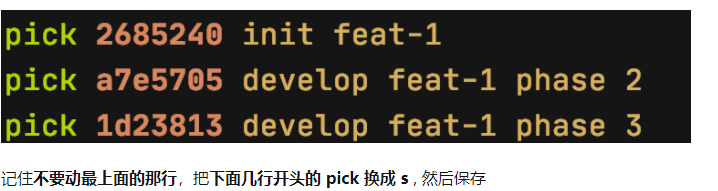
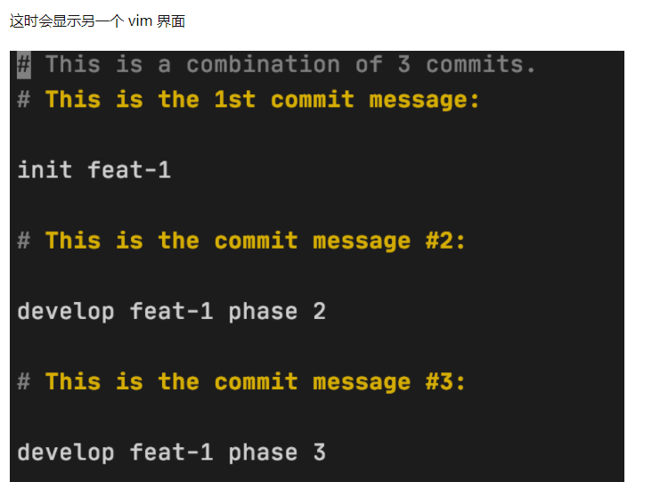
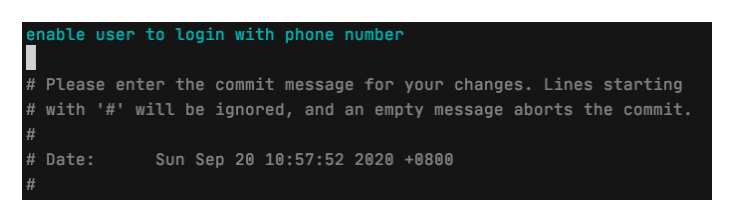

## 工作场景一 —— 新任务（开发新特性 / 修bug）

* **git status** 查看当前项目的状态，如果有未保存的修改，就**git add .** 和 **git commit -m "xyz"** 保存下来

* 切换到开发主分支，假如项目的主分支叫develop 就使用 **git checkout develop
  **

* 确保主分支是最新版本 **git pull origin develop
  **

* 创建新分支 **git checkout -b feat-1** (创建一个叫做 feat-1的新分支)

* 开始写代码

* 如果当前任务比较复杂，代码量比较多，我通常会多次使用 **git add .** 和 **git commit -m "xxx"** 保存当前代码 (记得把 xxx 换成更有意义的文字， 如 git commit -m "init feature-1" )

* 代码开发结束，整理 commit message
  首先仍然是用 **git status** 确保所有代码都commit了（没有就 git add 和 git commit )
  第二步 **git log –oneline** 查看当前分支下最近的 commit message

* 假设我开发 feat-1 中 commit 了3次，三次的commit message  **commit 是为了防止意外丢失代码，但是在推到远端之前，最好把一次开发的 commit 合并成一个，避免污染远端的 git commit message**

* 执行 **git rebase -i HEAD~3**

  

删除所有内容( #开头的可以忽略），然后写一句简短、准确的句子作为这次开发的 commit message，如

## 工作场景二 —— 开发进行一半，需要远端主分支的最新代码

* **git status** 查看当前项目的状态，如果有未保存的修改，就**git add .** 和 **git commit -m "xyz"** 保存下来
* **git pull --rebase origin develop** 使用这个指令将远端的主分支以 rebase 的形式 “合进”当前分支
* **git log –oneline** 查看当前分支下的 commit message 是否符合预期
* -rebase 可以让git历史最干净、整洁 —— 所有本地开发的 commit 都会出现在远端主分支里的 commit 之后；并且可以避免额外引入一次 merge 的 commit

## 工作场景三 —— 希望把某个分支中的某个 commit 对应的代码复制到当前分支

* 实验性的分支
* **git st** 查看当前项目的状态，如果有未保存的修改，就**git add .** 和 **git ci -m "xyz"** 保存下来
* 假设我们需要的是 feat-1 这个分支的某个 commit ，使用 **git logl feat-1** 查看最近这个分支的所有 commit 记录，如
* 使用 **git cherry-pick c843c37** 将这个 commit 对应的代码复制到当前分支

## 使用git的一些原则

* 永远记得 git st 和 git logl 来确认当前分支的状态
* 宁愿临时制造一些无用的 commit 来保证代码不会丢失，也不要轻信自己的记忆力
* 谨慎（最好能避免）使用 git stash ，极易造成代码丢失
* 认真对待、编写每次的 commit message —— 它们能在关键时刻救你一命
* 必要的时候可以创建一些临时的分支写实验性的代码，而不是依赖 git reset 撤销 commit —— 大多数人在 git reset 的时候容易犯错误

## git diff 如果最后有一行 修改后也要有newline

* git diff [file] 暂存区和工作区的区别

* git diff –cached [file] 暂存区和最新版本库的区别
* **git diff HEAD** 工作区和head的区别

## 撤销修改

`git checkout -- file`可以丢弃工作区的修改

自修改后还没有被放到暂存区，现在，撤销修改就回到和版本库一模一样的状态

已经添加到暂存区后，又作了修改，现在，撤销修改就回到添加到暂存区后的状态

`git reset HEAD <file>`可以把暂存区的修改撤销掉（unstage），重新放回工作区

场景1：当你改乱了工作区某个文件的内容，想直接丢弃工作区的修改时，用命令`git checkout -- file`。

场景2：当你不但改乱了工作区某个文件的内容，还添加到了暂存区时，想丢弃修改，分两步，第一步用命令`git reset HEAD <file>`，可以把暂存区的修改撤销掉（unstage），重新放回工作区，第二步按场景1操作。

场景3：已经提交了不合适的修改到版本库时，想要撤销本次提交，[版本回退git reset --hard commit_id，不过前提是没有推送到远程库。

`git rm`用于删除一个文件

`git checkout`其实是用版本库里的版本替换工作区的版本，无论工作区是修改还是删除，都可以“一键还原”

## 分支管理

* git branch -d dev 删除分支
* 丢弃一个没有被合并过的分支，可以通过`git branch -D <name>`强行删除
* git merge --no-ff -m "merge with no-ff" dev   不使用fast forward  会commit一条新的、
* 修bug git stash 然后到master去创建分支  回来 git stash list git stash pop/git stash apply  版本号
* bug在dev分支也有  回复场景后先add commit 然后  git cherry-pick修复分支版本号

## 多人合作

* `master`分支是主分支，因此要时刻与远程同步；
* `dev`分支是开发分支，团队所有成员都需要在上面工作，所以也需要与远程同步；
* bug分支只用于在本地修复bug，就没必要推到远程了，除非老板要看看你每周到底修复了几个bug；
* feature分支是否推到远程，取决于你是否和你的小伙伴合作在上面开发。

抓取分支

* clone 	 只能看到本地的`master`分支  要在`dev`分支上开发，就必须创建远程`origin`的`dev`分支到本地
* git checkout -b dev origin/dev
* git branch --set-upstream-to=origin/dev dev   git pull 然后push

1. 首先，可以试图用`git push origin <branch-name>`推送自己的修改；
2. 如果推送失败，则因为远程分支比你的本地更新，需要先用`git pull`试图合并；
3. 如果合并有冲突，则解决冲突，并在本地提交；
4. 没有冲突或者解决掉冲突后，再用`git push origin <branch-name>`推送就能成功！

如果`git pull`提示`no tracking information`，则说明本地分支和远程分支的链接关系没有创建，用命令`git branch --set-upstream-to <branch-name> origin/<branch-name>`

## rabase

* 后push的童鞋不得不先pull，在本地合并，然后才能push成功

[rebase](https://blog.csdn.net/liuxiaoheng1992/article/details/79108233)

* git rebase --onto master feature bugFix git执行这条命令的时候会先找到feature和bugFix的共同祖先，然后将共同祖先之后的部分rebase到master。

## github初始化

* git push -u origin master   `-u`也就是`--set-upstream`, 代表的是更新 默认推送的地方，这里就是默认以后`git pull`和`git push`时，都是推送和拉自 origin。

## 令 commit 更漂亮

* git pull gakki feat-add-listener  把 `gakki` 仓库拉到 `feat-add-listerner` 分支 等价于
* git fetch gakki          //把 gakki 仓库的东西都拉下来本地 git rebase gakki/origin feat-add-lister //把 gakki 的 master 分支 rebase 到 feat-add-lister

## 合并你的 commits

* `git rebase -i HEAD~4` 对前四个补丁就行修改
* 默认 pick， 不做更改
* reword：改 commit message
* squash：当前补丁跟上一个补丁合并
* fixup: 跟 squash 作用一样，但是会丢弃当前 commit 信息，使用上一个的； squash 则是可以让你重新写

## 不用担心的回退

* `git reset --hard commitID`, 把整个 git 回退到这个 commitID 里
* soft  所做的 commit 丢掉，而改动都保留在本地——通常用来修改，再重新 commit 一遍。
* 当前修改没有 commit 的时候，不能 checkout 切换分支。此时不想 commit，便需要 `git stash` 暂存更改

[ Rebase, Squash, Amend](https://thoughtbot.com/blog/git-interactive-rebase-squash-amend-rewriting-history#reword-the-last-commit-message)