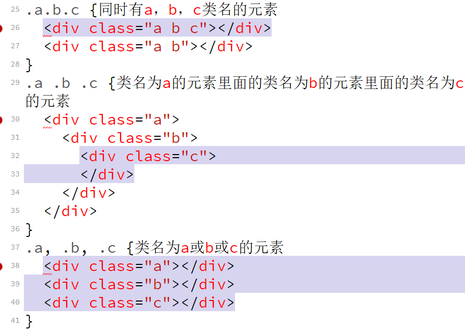

## 元素

* 每个元素生成一个box

### 替换元素和非替换元素

* 替换元素：用来替换元素内容的部分并非由文档内容直接表示。比如img元素，本身没有内容，由文档本身之外的一个图像文件替换。input元素也是，取决于type，替换input。

* 非替换元素：在元素本身生成的框中显示。

## 元素显示角色

### 块级元素 

块级元素生成元素框，会**==填充满其父元素==**的内容区。元素框之前和之后生成分隔符。列表项是块级元素。 替换元素可以是块级，但一般都不是。

### 行内元素

在一个文本内生成元素框，不会打断文本。

```html
<style>
    p {
      display: inline;
    }

    em {
      display: block;
    }
</style>

<p>This is a paragraph with <em>an inline element</em> within it.</p>
<!-- 可以通过css把p变成inline，把em变成block，但是不能翻转元素的嵌套关系 -->
```

* https://developer.mozilla.org/en-US/docs/Web/Guide/HTML/Content_categories 
* https://github.com/joshbuchea/HEAD

## 文档与css关联的多种方式

### link标记

```html
<link rel="stylesheet" href="" media="">
```

* media的属性：all，screen，print

### 候选样式表

将rel的属性设置为alternate stylesheet。只有在用户选择这个样式表时才会显现。如果浏览器能使用候选样式表，它会使用link元素的titlle属性值生成一个候选样式列表。

```html
  <link rel="stylesheet" href="" title="default">
  <link rel="alternate stylesheet" href="" title="Big Test">
  <link rel="alternate stylesheet" href="" title="Crazy colors!">
```

* stylesheet优先使用，但一旦选择了候选样式表，不会再使用首选样式表了。将一组样式表指定为首选样式表，那么只会使用其中的某一个。没有为样式指定title，那么他将作为一个永久样式表。

### @import

* 必须出现在style元素中的最前面。或者文件顶部。相对路径。串行下载，不常用。

```html
  <style>
    @import url(test.css);
    @import "test.css";
    
    @import url(test.css) all;
    @import "test.css" screen;
  </style>
```

* 使用：外部样式表需要使用其他外部样式表的样式。因为外部样式表不能包含任何文档标记，所以不能使用link元素。但能用@import。

### 内联样式

* 通过html的style属性  

##  选择器

* 一条规则以一个分号结束，否则不生效。

###  通配选择器

<style>
   * {
     color: hotpink;
   }
</style>
<!-- 指定所有元素 -->

### 多类选择器
```html
  <style>
    .warning.urgent {
      background-color: silver;
    }
    /*必须两个类名全部满足*/
    p.waring.help
    {
      /*如果有一个没有类名help，整个都不会生效
      匹配既要是p class属性又要是包含waring 和help*/
      
    }
  </style>
<p class="urgent warning">This is a paragraph。</p>  
<!--顺序不一样但是还是有效-->

```

* 类选择器和id选择器区分大小写

  ```html
   div.foo {
        /* 既要有div标签 又有foo类名 */
      }
  
      div.foo.bar {
        /* 既要有div标签 又有foo类名 还要有bar类名 */
      }
  ```

  

###属性选择器

* 要选择有class属性的所有h1元素 

```html
  <style>
    h1[class] {
      color: silver;
    }
  </style>
```

* 把所有包含title的元素变为粗体显示

```html
  <style>
    [title] {
      font-weight: bold;
    }
  </style>
```

* 还可以根据多个属性进行选择

```html
  <style>
    a[href][title] {
      font-weight: bold;
    }
  </style>
```

### 根据具体属性值选择

```html
  <style>
    a[href="http://www.baidu.com/"][title="W3C HOME"] {
      font-weight: bold;
    }
  </style>
```

* 如果遇到的值本身包含一个用空格分隔的值列表， 匹配就会出问题。必须写作。

```html
  <style>
    p[class="urgent warning"] {
      font-weight: bold;
    }
  </style>
<p class="urgent warning">This is a paragraph。</p>
<!--类名顺序不能乱-->
```

### 根据部分属性值选择

```html
  <style>
    p[class~="warning"] {
      font-weight: bold;
    }
  </style>
<p class="urgent warning">This is a paragraph。</p> 
```

```html
  <style>
   img[title~="Figure"]{
      border:1px solid grey;
   }
   /* 会选择所有title文本包含Figure的所有图像 
    figure必须是一个完整独立的单词，两边有空格或者在两头
    可以模拟类选择器 */
  </style>
```

### 字串匹配属性选择器

* [foo^=“bar”]    选择所有以bar开头的元素

* [foo$=“bar”]    选择所有以bar结尾的元素

* [foo*=“bar”]    选择foo属性值中包含子串bar的所有元素

* 可以根据属性中的字串选择元素

### 特定属性选择类型

`[lang|=“en”]`

* 会选择lang属性等于en或者以en开头的所有元素

* lang属性 设定语言

  ```HTML
  <style>
        /* 类名以 fa- 开头 */
      [class^="fa-"],[class*=" fa-"]
      /* 类名以 -ui 结尾 */
      [class$="-ui"],[class*="-ui "]
  
      [href$=".pdf" i]
      {
        font-size: 30px;
      }
      /* 空格加i 忽略大小写 可以匹配到.PDF */
  </style>
  ```

  

### 后代选择器

```html
  <style>
    h1 em {
      color: gray;
      h1里面的em
    }
    blockquote b , p b {
    }
  </style>
```

* 使用后代选择器向同类元素应用不同的样式
  ```html
  <style>
       td.siderbar a:link{
     }
  </style>
  ```

### 选择子元素

* 字结合符  >

* 选择全部直接子元素而不是后代元素

### 选择相邻兄弟元素

* `h1+p`  选择h1后面相邻兄弟元素p 

* `h1~p` h1后面的所有p兄弟元素

  

### 伪类和伪元素

* 状态伪类

```html
  <style>
    :link {}

    :visited {}
      /* visited只能改变颜色，隐私问题 */
    
    :focus {}
		:hover {}
    /* tab */
    :active {}
    /* 有顺序 */
  </style>
```

* 位置伪类

```html
  <style>
    /* :first-child {
      border: solid 5px;
    } */
    /* 选中所有父元素的第一个子元素，这里html也会被选中 */
    :last-child {}

    /* 选中所有父元素的最后一个子元素 */
    :nth-chilid(n) {}

    /* 选中父元素的第n个子元素  */
    :nth-chilid(2n) {}
    :nth-chilid(2n+1) {}
    :nth-chilid(-2n+1) {}
    /* n=0 为1 只能选第一个 */
    :nth-last-child(n){}
    /* 倒数第n个 */
    :nth-last-child(n+2){}
    :nth-child(n+3):nth-last-child(n+2){}
    /* 正数第三个以后，倒数第二个及之前。 */
    :nth-child(n+3):nth-last-child(-n+7){}
    /* 正数第三个到正数第七个 */
    odd even
    :first-of-type
    /*把有同一个父元素的标签按照名字分类，各个分类中的第一个*/、
    :nth-of-type(n)
  </style>
```

* 选择器取反 

```html
  <style>
    :not(p) {}
    /* 里面只能写单一选择器 */
    :not(p):not(.foo){
      color: red;
    }
  </style>
```

* 特殊选择器

```html
<style>
     :root {}
    /* 选择根元素，基本上会选中html元素。 */
    :empty {}
    /* 选择空元素 有空格也不算 */
</style>
```

  ```html
<!DOCTYPE html>
<html lang="en">
<head>
  <meta charset="UTF-8">
  <meta name="viewport" content="width=device-width, initial-scale=1.0">
  <meta http-equiv="X-UA-Compatible" content="ie=edge">
  <title>Document</title>
  <link rel="stylesheet" href="" title="default">
  <link rel="alternate stylesheet" href="" title="Big Test">
  <link rel="alternate stylesheet" href="" title="Crazy colors!">
  <style>
    :target {
      background-color: yellow;
    }
    /* 目标选择器 选择的是一个【id为地址栏url中#后面的内容(hash)】的元素 */
  </style>
</head>
<body>
  <ul>
    <li id="top">Lorem <a href="#bottom">bottom</a></li>
    <li>Accusantium</li>
    <li>Fugiat</li>
  </ul>
  <div>
    <div>Lorem.</div>
    <div>Doloribus!</div>
    <div id="bottom">Eveniet. <a href="#top">top</a></div>
  </div>
</body>
</html>
  ```

* 表单元素状态选择器

```html
  <style>
    :required{}
    :optional{} /*选填*/

    :valid{}
    :invalid{}   /*填错，填对*/

    :disabled{}
    :enabled{}  /*启用 禁用*/

    :in-range{} /* input number min max*/
    :out-of-range{}

    :checked{}  /* 打钩的 */
   input:not(:checked){}

  </style>
```

### 选择器的优先级

* （0,0,0,0） 四位的无穷进制数

* id选择器   0,1,0,0

* 类选择器，属性选择器，伪类选择器。 0,0,1,0

* 元素选择器（标签选择器),伪元素选择器 0,0,0,1

* 连接符 > + ~ 等不参加优先级运算

* 通配符 * * * *  0,0,0,0

* 内联样式/行内样式/行间样式/inline style 1,0,0,0

* !important 有与important冲突的属性，important都会占上风。

  `color: red !important;`

* ==继承来的样式没有优先级，比*的有限级还要小==

```html
  <style>
  #foo{
    color: red;
  }
  .bar{
    color: blue;
  }
  </style>
</head>
<body>
  <div id="foo">
    <span class="bar">color</span>
  </div>
</body>
```

* 这里是蓝色，因为foo没有直接选中span，bar直接选中了span 继承的样式没有优先级。

* `<font color="red">font</font>`

  * 这里的color不是style，不是内联。优先级0,0,0,0，且在css文件最开头。

### 层叠样式

* 用户自定义important样式

* 网站作者important样式 authored style

* 网站作者作者普通样式

* 用户自定义普通样式 Custom.css

* 默认样式，浏览器内置样式，User Agent Style

* 优先级一样的话，按出现的顺序排列，后出现的优先级更高

  `body :first-child` 选择body后代中所有的是第一个子元素的元素

## 值与数字

* 数字：表示倍数或次数

* 百分比：根据属性判断相对于父元素，或者相对于字号。百分比与纯数字不可互换。 

* 颜色（R G B）
  * hex color #HHHHHH
  * hexa #ff00ff00
  * \#abc  简写 #aabbcc
  * rgb(r,g,b)(0-255,0-255,0-255）或者用百分比
  * rgba(r,g,b,0-1)
  * hsl（色相，饱和度，明度）

* 长度
  * 绝对长度单位

    *  in(ch) 英寸
    *  cm 厘米 centimeters
  	*  mm 毫米 millimeters
    *  -moz-mm 火狐浏览器
  	*  pt point 72分之一inch
    *   pc pica 6分之一inch
  	* 大部分时候不准，取决于分辨率及系统设置，但打印的时候比较准。 
	* 相对长度单位
		* px，css像素。不同大小显示器，像素点大小不一样。 

```html
.foo {
    font-size: 30px;
    width:10em
<!-- 300px 宽 -->
}
.foo {
    font-size: 30em;
    width:10em
   <!-- font-szie取父元素 -->
}
```
```html
<div class="foo">
    <p></p>
  </div>
  <style>
    .foo {
      font-size: 30px;
    }
    p {
      width: 10em;//2 450px
      font-size: 1.5em; //1 45px
    }
  </style>
```
  * rem 根元素字号，根元素html  默认16px
  * ex   、小写 x字符的高度，几乎没用处。有些浏览器会把它计算成0.5em。
  * ch    0字符的宽度
  * vw/vh   视口宽度或高度的百分之一，包含滚动条。
  *  vmax/vmin   vmax = max(vw, vh)视口宽或者高较大的那一个的100之一
  *  width: calc(2 * 30em - 40%)  2*30em-width的40% ==运算符两边必须有空格==

 

* 角度

  * degree 角度  45deg    90deg
  * radian 弧度  3.14rad =180deg 
  * turn-> 360deg=6.28rad
  * transform ：rotate（20deg）
* 时间
  * 1s
  * 1.1s
  * .2s
  * .3s
  * 1ms
  * 1s =1000ms
* hz

* url
* css关键字
* 字符串
* 取属性的值

## 字体

### 字体族

* serif  衬线字体
* sans-serif   非衬线字体
* monospace   等宽字体


* 使用通用字体族

  `body {font-family: sans-serif}`，浏览器将自动选择一款没有衬线的字体。

* 使用指定的字体`h1{font-family: "MicroSoft YaHei";}`

* 如果用户电脑没有安装指定字体，可以指定退化方案。

  `h1{font-family: "Helvetica","微软雅黑"，sans-serif;}`最好提供一个字体族名称作为最后的退化方案。英文字体在前。通用字体族必须不能加引号。

### 字重

* font-weight
  * normal
  * bold，bolder，lighter
  * font-weight ：100 -900 必须是整百
  * inherit
* 一般来说，一些字体都会预定义一些不同字重的字体。于是可以`{font-family: 'Zurich Light'`
* 一般指定主字体，然后指定font-weight，由浏览器来选择具体字重的字体文件，或者计算出来。

### 字号

* font-size ：xx-samll，x-small，small，medium，large，x-large，xx-large。

* 一个绝对大小与相邻的绝对大小的缩放因子是1.5以及0.66。比如如果medium是10px，那large就是15px，small就是6.66px。但不同浏览器缩放因子可能并不一样。所以这几个关键字没用武之地。

* 百分比单位。相对于父元素的大小，即继承过来的值。跟em的效果几乎是一样的。html的字体大小是16px。

* fontsize总是继承的是**计算后的值，而不是书写时**的值。

* 长度单位，px

  ```html
  div>p>span
  div {font-size: 10px;}
  p {font-size: 120%;}
  span {font-size: 120%;} -> 14.4px
  ```

  
### font-style与font-variants

* font-style ：normal|italic|oblique

上面两个都是斜体，但是有啥区别呢？

       + italic是另一个专门设计好的斜体字体
    
          * 比如正常字体是 Roboto
    
          * 则italic字体可能会是 Roboto Italic，Roboto Cursive
    
       + 而oblique则是在正体的文字基础上变幻出来的一个斜体字
    
          * 而oblique则一般会map到Roboto Slanted，Roboto Incline， Roboto Oblique
* font-variant： normal|small-caps|

  	*  small-caps :把小写字母写成大写字母，但比本来的大写字母小一些。文章标题。

* text-transform：uppercase | lowercase|capitalize 把所有（大）小写字母变成大（小）写。每个单词首字母大写

​      举例比如优惠码的输入框。

* font的集合写法

  ​	[font-style || font-variant || font-weight] font-size[ / line-height] font-family

​           前三个顺序不重要。如果前三个属性有的值是normal，可以省略该属性。line-height可以省略，但一旦出现必须加/并且跟在font-size后面。

font-size和font-family必须出现，且顺序不能乱。

## 文字相关属性

### 文字缩进 text-indent

* 文字缩进  可填负数，如果够大，可以隐藏文字。但是元素

高度还是有的。

* 可用百分比，相对于父元素。如果想相对于自己，包一层和自己一样大小的元素。

* 应用 `text-indent`：-99999px，隐藏文字，用背景图片“替换”标签内容。-2em实现首行悬挂，2em实现首行缩进。也可以用`font-size：0`；但是字号会被继承下去。
* 本属性只适用于块级元素，不适用于内联元素。

### 文字水平对齐 text-align

* `left|right|center|justify`  两端对齐

* text-align只能居中文字

  ```html
  <!DOCTYPE html>
  <html lang="en">
  <head>
    <meta charset="UTF-8">
    <meta name="viewport" content="width=device-width, initial-scale=1.0">
    <meta http-equiv="X-UA-Compatible" content="ie=edge">
    <title>Document</title>
    <STYLE>
      ul {
        width: 100px;
        border: 2px solid;
      }
  
      li {
        text-align: justify;
      }
  
      img {
        width: 100%;
        height: 5px;
      }
    </STYLE>
  </head>
  
  <body>
    <ul>
      <li>姓名</li>
      <li>电话号</li>
      <li>收货地址</li>
    </ul>
  </body>
  </html>
  ```

  

### 文字在垂直方向对齐

https://www.zhangxinxu.com/wordpress/2009/11/css%E8%A1%8C%E9%AB%98line-height%E7%9A%84%E4%B8%80%E4%BA%9B%E6%B7%B1%E5%85%A5%E7%90%86%E8%A7%A3%E5%8F%8A%E5%BA%94%E7%94%A8/

https://www.zhangxinxu.com/wordpress/2015/08/css-deep-understand-vertical-align-and-line-height/

* `line-height`:指文本行基线之间的距离
* 行间距=line-height - font-size      可能是负值   行间距/2应用到内容区顶部和底部就是该元素的行内框。                                                                                                                                                                                                                                                                                                                                                                                                                                                                                                                                                                                                                                                                                                                                                                                                                                                                                                                                                                                                                                                                                                                                                                                                                 
* 应用：单行文字垂直居中，是行高等于文字高度
* 百分比相对于字号大小

```html
	h1{
		font-size:40px;
		border: 2px solid;
		line-height:2;
}
 <!-- 200% 后代继承80px 写2后代继承2-->
```

* vertical-align
  * 这个属性适用于【内联元素】
  * baseline ：让元素的基线与其父元素行框的基线对齐。如果一个元素没有基线，如img，input，则让其底部与外面的文字对齐。即使行框没有文字也是一样。应用，图片跟文字底部对不齐
  * sub ：元素的baseline会比该行文字低。
  * super：。。。。高
  * bottom：目标元素底部跟这一行的底部对齐
  * top：目标元素顶部跟这一行顶部对齐
  * text-top
  * text-bottom 元素的顶/底部与文字的顶/底部对齐   
  *  middle         并不是垂直居中。而是把元素的中间与baseline上面0.5ex，即四分之一对齐。
  * 数值
  * 百分比 ==相对于自己的line-height==
  * 在作用于表格时，只有baseline，top，middle，bottom有效。其他无效。

* word-spacing

  `word-spacing:15px`  其值是添加到本身空格的值 x+15

  * normal：相当于写成0

  * 长度写成多少，间隔就是空格的宽度加这个值。可以为负值。
  
* letter-spacing 改变字母间的间隔。

* text-align：justify和word-spacing连用，字母间距可能会被改变。

* 给了letter-spacing一个指定的值话，则justify就不会影响它了。

* text-transform
  * uppercase   所有字母变成大写
  * lowercase   所有字母变成大写
  * capitalize   每个单词首字母大写
  * 属性效果先于font-variant

* text-decoration

  * underline         下划线

  * overline             上划线

  * line-through      删除线

  * 子元素没办法去掉父元素的下划线

* text-shadow
  
* 取值：水平偏移，垂直偏移，模糊半径，颜色。颜色默认为黑。模糊半径可以不写，为0，可用逗号写多组阴影。
  
* box-shadow

  水平偏移，垂直偏移，模糊半径，扩散半径，颜色；下一组；

* white-space：指定如何处理空格与换行，以及自动换行。
* word-break 指定单词如何换行
* overflow-wrap 
* direction：ltr|rtl  
* unicode-bidi


### 盒模型

2019-11-25

box-sizing 默认为content-box 可改为border-box

```css
html{
box-sizing:border-box;
}
*{
  box-sizing:inherit;
}
xxx{
  box-sizing:content-box
}

/*这样就不用为xxx内部写box-sizing了*/
```

* 外边距可以为负 内边距不能为负
* 透过padding可以看见背景颜色 边框透明也能可到背景色或者图

 