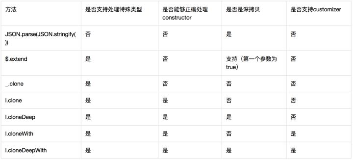
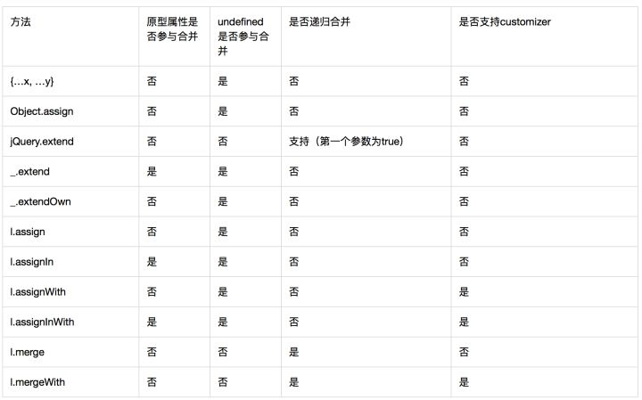

https://zhuanlan.zhihu.com/p/29966500

对象的

合并与拷贝

(复制或克隆)

拷贝有时候会提出一些特殊的要求，而这些要求是普通的合并操作不关注的。举个例子，拷贝往往会要求目标对象和源对象 constructor 相同，一个 Person 类的实例被拷贝后应该还是一个 Person，不能变成 Dog

合并一般要求支持多个源对象向目标对象合并，而拷贝的源对象只有一个。

JSON.parse(JSON.stringify()) //来实现对象复制

Object.assign()       //来实现合并

//扩展运算符，调用形如 { …x, …y } 的声明，也能实现对象的合并。

拷贝方法

JSON.parse(JSON.stringify())

$.extend

l.clone

l.cloneDeep

l.cloneWith

l.cloneDeepWith

1.是否支持处理特殊类型？

2.是否能够正确处理 constructor？ 目标对象应该保留源对象的 constructor。

3.是否是深拷贝？

浅拷贝直接把引用地址原样拿来，此时，不管源对象还是目标对象，修改引用属性后另一个对象的同名属性都会受到影响。深拷贝则会递归地在目标对象上创建值，目标对象和源对象之间将完全独立。

4.是否支持 customizer？

customizer 是指一个处理方法，允许用户定制拷贝中的处理过程

lodash 提供了4个 clone 相关方法。只有 lodash 的 clone 方法正确处理了 constructor，而 customizer 也只有 lodash 一家独有（两个with 方法）。

JSON.parse(JSON.stringify())

合并方法

{ …x, …y }

Object.assign

$.extend

l.assign

l.assignIn

l.assignWith

l.assignInWith

l.merge

l.mergeWith

1.原型属性是否参与合并？

2.undefined 值是否参与合并？

3.是否递归合并？

4.是否支持 customizer？

原生方法中使用Object.assign方法和使用扩展操作符完全一样。

除了lodash 的 merge，其余方法都不支持递归合并。

除了lodash 的 merge，其余方法undefined都参与合并。

除了lodash 的三个 with 方法，其余方法都不支持 customizer。

